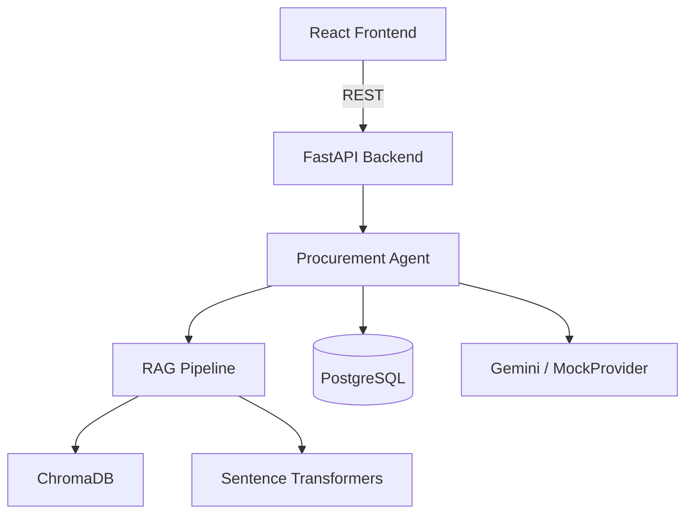

# Enterprise Procurement Copilot


A production-style Generative AI application that helps procurement teams query supplier policies, analyze purchase order data, classify items, and draft communications — all through natural language.

Combines **Retrieval-Augmented Generation (RAG)** over procurement policy documents with **structured data access** through agent tool use, backed by **Google Gemini** (with a MockProvider fallback for local development).

---

## Problem Statement

Procurement teams manage supplier information, purchase orders, compliance policies, and item classifications across disconnected systems. Finding policy details, assessing supplier risk, or classifying spend categories requires navigating multiple tools and documents.

This copilot provides a single conversational interface grounded in real data sources — not a hallucinating chatbot.

---

## Solution

```
User question → Agent (intent routing) → Tools (PostgreSQL / ChromaDB)
                                        ↓
                               Gemini / MockProvider (answer synthesis)
                                        ↓
                          Grounded answer + source citations + trace
```

---

## Architecture



See [docs/architecture.md](docs/architecture.md) for full breakdown.

---

## Features

- **Natural language procurement Q&A** grounded in retrieved policy documents
- **Supplier risk summaries** with PO history from structured data
- **UNSPSC item classification** using keyword + embedding similarity
- **Supplier follow-up email drafting** with policy citations
- **Agent trace panel** — every tool call and reasoning step is visible
- **Grounding status badges** — `grounded / partially_grounded / not_grounded`
- **Role-based access** (analyst / manager / admin)
- **Works without a Gemini API key** — MockProvider returns deterministic answers
- **Docker Compose** — one command to start everything

---

## Tech Stack

**Backend:** Python 3.11 · FastAPI · SQLAlchemy · PostgreSQL · ChromaDB · Sentence Transformers · Google Gemini API · Pytest · Ruff

**Frontend:** React 18 · TypeScript · Vite · Tailwind CSS · React Router

**DevOps:** Docker Compose · GitHub Actions CI · Makefile

---

## Quick Start

### Prerequisites
- Docker Desktop
- (Optional) Gemini API key from [Google AI Studio](https://aistudio.google.com/)

### 1. Clone and configure

```bash
git clone https://github.com/Gees14/enterprise-procurement-copilot
cd enterprise-procurement-copilot
cp .env.example .env
# Optionally: add your GEMINI_API_KEY to .env
```

### 2. Start all services

```bash
make up
# or: docker compose up -d
```

This starts:
- PostgreSQL on port 5432
- ChromaDB on port 8001
- FastAPI backend on port 8000
- React frontend on port 5173

### 3. Seed sample data & ingest documents

```bash
# Seed database (runs automatically on startup via docker-compose command)
make seed

# Ingest policy documents into ChromaDB
curl -X POST http://localhost:8000/documents/ingest-sample
```

### 4. Open the app

- **Frontend:** http://localhost:5173
- **API docs (Swagger):** http://localhost:8000/docs

---

## Environment Variables

| Variable | Required | Default | Description |
|----------|----------|---------|-------------|
| `GEMINI_API_KEY` | No | `""` | Uses MockProvider if empty |
| `DATABASE_URL` | Yes | set by compose | PostgreSQL connection string |
| `EMBEDDING_MODEL` | No | `all-MiniLM-L6-v2` | Sentence Transformers model |
| `CHROMA_HOST` | No | `chromadb` | ChromaDB host |
| `CORS_ORIGINS` | No | `http://localhost:5173` | Allowed frontend origins |

---

## Example Questions

| Question | Intent | Tools Called |
|---------|--------|-------------|
| "What documents are required for supplier approval?" | policy_query | RAG retrieval |
| "Which suppliers had the highest purchase order volume?" | top_suppliers | PostgreSQL aggregation |
| "Classify: hydraulic hose assembly 3/4 inch SAE 100R2" | classify_item | UNSPSC lookup |
| "Summarize supplier SUP-001 including recent POs" | supplier_detail_with_po | Supplier + PO service |
| "Draft a follow-up email for missing compliance documents" | email_draft | RAG + LLM generation |
| "What does the PO policy say about payment terms?" | policy_query | RAG retrieval |

---

## Running Tests

```bash
make test
# or inside Docker:
docker compose exec backend pytest tests/ -v
# or locally (no Docker required):
cd backend && pytest tests/ -v
```

**113 tests** across 9 files — all pass without PostgreSQL, ChromaDB, or API keys:

| File | Tests | Coverage |
|------|-------|----------|
| test_health.py | 1 | FastAPI health endpoint |
| test_chunking.py | 4 | Text chunking with overlap |
| test_governance.py | 8 | RBAC access control + grounding status |
| test_llm_provider.py | 4 | MockProvider deterministic output |
| test_supplier_service.py | 14 | Supplier list / filter / detail / profile-dict |
| test_purchase_order_service.py | 21 | PO list / filter / analytics / agent tools |
| test_retrieval.py | 11 | RAG score filter, top-k, excerpt truncation |
| test_classification_service.py | 16 | Keyword + embedding UNSPSC classification |
| test_agent.py | 34 | Intent detection, tool routing, grounding, RBAC |

---

## Evaluation

Run the evaluation harness against 8 representative questions:

```bash
# Requires full stack running (make up + ingest-sample)
cd backend && python -m app.evaluation.rag_eval
```

Expected results (MockProvider, no Gemini key):

| Metric | Score |
|--------|-------|
| Intent accuracy | 8/8 (100%) |
| Tool accuracy | 8/8 (100%) |
| Retrieval hit rate | 5/5 RAG questions (100%) |
| Avg latency (mock) | < 100 ms |

---

## Development Commands

```bash
make up        # Start all services
make down      # Stop all services
make logs      # Tail backend logs
make seed      # Seed database
make test      # Run backend tests
make lint      # Run Ruff linter
make format    # Run Ruff formatter
make clean     # Remove all containers and volumes
```

---

## Project Structure

```
enterprise-procurement-copilot/
├── backend/
│   ├── app/
│   │   ├── agents/          # Intent routing, tools, prompt building, trace
│   │   ├── api/             # FastAPI route handlers
│   │   ├── core/            # Config, logging, RBAC
│   │   ├── db/              # SQLAlchemy models, seed script
│   │   ├── evaluation/      # Test questions, eval runner
│   │   ├── rag/             # Chunking, embeddings, ChromaDB, retrieval
│   │   ├── schemas/         # Pydantic request/response models
│   │   └── services/        # Business logic (suppliers, POs, LLM, governance)
│   └── tests/
├── frontend/src/
│   ├── api/                 # Centralized API client
│   ├── pages/               # Dashboard, Copilot, Suppliers, Documents
│   └── types/               # TypeScript type definitions
├── data/
│   ├── sample_suppliers.csv
│   ├── sample_purchase_orders.csv
│   ├── sample_unspsc_categories.csv
│   └── policy_documents/    # Markdown policy docs for RAG
├── docs/                    # Architecture, API contract, agent design, evaluation
├── docker-compose.yml
├── Makefile
└── .env.example
```

---

## Screenshots

> _Coming soon — run the app locally with `make up` to see it in action._

---

## Future Improvements

- [ ] LLM-based intent detection (replace rule-based routing)
- [ ] Streaming responses for long answers
- [ ] PDF document support (structure in place, pypdf integrated)
- [ ] Alembic database migrations
- [ ] Conversation history / multi-turn memory
- [ ] LLM-as-judge evaluation scoring
- [ ] GCP Cloud Run deployment (see [docs/cloud_deployment_notes.md](docs/cloud_deployment_notes.md))

---

## Skills Demonstrated

- **Retrieval-Augmented Generation** — document ingestion, chunking, embedding, vector search, source citation
- **Agent tool use** — intent routing, tool dispatch, structured data access, trace logging
- **LLM provider abstraction** — Gemini integration with MockProvider fallback pattern
- **Enterprise AI governance** — grounding status, role-based access, disclaimers, audit trail
- **FastAPI architecture** — clean layer separation (routes → services → db), Pydantic schemas
- **Domain expertise** — UNSPSC taxonomy, procurement workflows, supplier risk, PO management
- **Full-stack delivery** — React + TypeScript + Tailwind, Docker Compose, GitHub Actions CI
