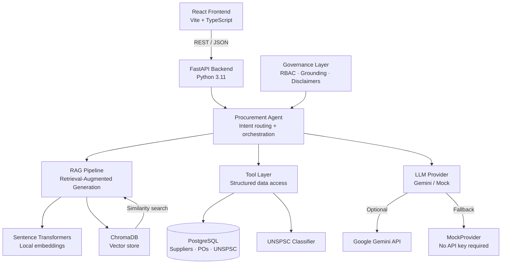

# Architecture

## System Overview



## Component Breakdown

### Frontend (React + Vite)
| Component | Purpose |
|-----------|---------|
| `App.tsx` | Router, global state (chat messages, user role) |
| `pages/Dashboard.tsx` | KPI cards, spend analytics, top suppliers |
| `pages/Copilot.tsx` | Chat interface with grounding badge, trace panel |
| `pages/Suppliers.tsx` | Supplier registry table with search |
| `pages/Documents.tsx` | Document list, ingest sample, upload |
| `api/` | Centralized API client layer |

### Backend (FastAPI)
| Layer | Responsibility |
|-------|---------------|
| `api/` | Route handlers — HTTP boundary only, no business logic |
| `services/` | Business logic — supplier service, PO service, classification |
| `agents/` | Intent detection, tool routing, prompt building, trace |
| `rag/` | Chunking, embedding, vector store, retrieval |
| `db/` | SQLAlchemy models, session management, seed script |
| `core/` | Config, logging, RBAC security |

### Data Flow: Chat Request

```
User → POST /chat
  ↓
ProcurementAgent.run()
  ├── _detect_intent(question)           # rule-based classification
  ├── route to tools based on intent
  │     ├── tool_retrieve_policy_documents()  → ChromaDB
  │     ├── tool_get_supplier_profile()       → PostgreSQL
  │     ├── tool_get_top_suppliers_by_spend() → PostgreSQL
  │     ├── tool_classify_unspsc_item()       → PostgreSQL
  │     └── tool_generate_supplier_followup_email()
  ├── build_chat_prompt(question, context, structured_data)
  ├── llm.generate(prompt)               # Gemini or MockProvider
  └── governance.assess_grounding()
  ↓
ChatResponse { answer, sources, tools_called, grounding_status, trace }
```

## Design Decisions

### Why rule-based intent detection?
MVP prioritizes reliability and explainability over flexibility. Rule-based routing makes trace output deterministic and debuggable. A future phase can replace it with LLM-based intent classification while keeping the same tool interface.

### Why MockProvider?
Allows the application to function fully without a paid API key. GitHub reviewers, demo environments, and CI pipelines all work without secrets.

### Why ChromaDB?
Self-hosted vector store that runs in Docker without external services. FAISS is also supported by the embedding layer — swapping is a config change.

### Why Sentence Transformers locally?
Avoids embedding API costs and latency. The `all-MiniLM-L6-v2` model is 80MB and runs on CPU in ~50ms per batch.

## Scalability Path

| Component | MVP | Production |
|-----------|-----|-----------|
| Vector store | ChromaDB (Docker) | Vertex AI Search or Pinecone |
| Embeddings | Sentence Transformers (CPU) | Vertex AI Embeddings API |
| LLM | Gemini 1.5 Flash | Gemini 1.5 Pro via Vertex AI |
| Database | PostgreSQL (Docker) | Cloud SQL |
| Backend | Uvicorn + Docker | Cloud Run (auto-scaling) |
| Frontend | Vite dev server | Cloud Storage + CDN |
